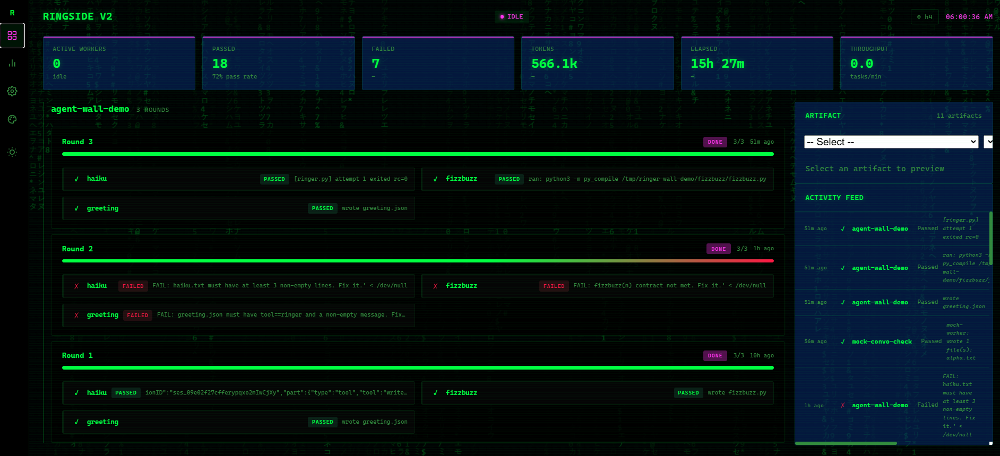

# Ringer


**Parallel AI-agent swarms that prove their work. Your expensive model plans and reviews; cheap workers do the typing.**

Frontier models are finally good enough to trust with real implementation — but their tokens are priced like senior-engineer hours, and most of a build is not senior-engineer work. It's scaffolding, migrations, test suites, batch transforms. Mechanical labor.

So split the roles. Your best model writes the specs and reviews the results. A swarm of cheap workers — Codex, Grok, anything with a CLI — does the implementation in parallel. Your premium budget stops scaling with lines of code written and starts scaling with decisions made.

One problem: parallel agents lie. "Done" doesn't mean working. Ringer doesn't take the worker's word for anything — it **executes your check command** against the artifact. Pass or fail is decided by running the code, not by reading the agent's summary. Failures retry once with the failure context injected, and every attempt is logged so your setup gets measurably better over time.

And because a swarm you can't see is a swarm you don't trust: **Ringside**, a local web page every run opens automatically, showing every live swarm on your machine — who's running it, what each worker is doing, elapsed time, token burn — in real time, plus a versioned library of what past runs produced.

## How it works

```
manifest.json ──▶ ringer.py ──▶ N parallel workers (codex exec, each in its own dir)
                      │                │
                      │                ▼
                      │         executed checks ── fail ──▶ retry once w/ failure context
                      │                │
                      ▼                ▼
              ~/.ringer/runs/    eval log (JSONL or Postgres)
                      │
                      ▼
              Ringside, in the browser (live, all swarms, all identities)
```

## The two-repo setup (Ringer + Feeder)

Ringer runs as a pair with **[Feeder (Agent-LLM-Feeder)](https://github.com/adamreading/Agent-LLM-Feeder)**.
Any agent can drive the swarm; nothing else is required.

| Repo | Role | Endpoint |
|---|---|---|
| **[Feeder](https://github.com/adamreading/Agent-LLM-Feeder)** | The **model proxy** — one unified key, one catalog, routing + failover + quality scoring, and the swarm **spend-cap** + no-progress **circuit-breaker**. Every worker's LLM comes from here. | `http://localhost:3001/v1` |
| **Ringer** (this repo) | The **orchestrator + swarm work-queue + agent-API + Ringside wall/kanban**. Files, claims, runs, and *verifies* swarm tasks; workers route their model calls **through Feeder**. | `http://localhost:8700` |

**Stand it up:** run Feeder (see its [README](https://github.com/adamreading/Agent-LLM-Feeder)) so `:3001/v1`
answers, then run the Ringer engine daemon:

```bash
python3 -m venv .venv && .venv/bin/pip install -r engine/requirements.txt
export RINGER_DB_DSN=postgresql://…            # a Postgres Ringer owns (Feeder can host it)
.venv/bin/uvicorn engine.app:app --host 127.0.0.1 --port 8700
curl -s localhost:8700/engine/health           # {ok:true, db_ready:true, ...}
```

The daemon serves the Ringside wall **and** the agent-API on one port. (For just the CLI —
`./ringer.py run manifest.json` — you don't need the daemon or the DB; see [Quickstart](#quickstart).)

## Security: the pre-push gate

This repo ships a **pre-push gate** — a git hook that scans every push for secrets
(API keys, tokens, private keys, `password=`/`apiKey=` literals) and for your
personal PII (email, name, employer, machine username). If it finds anything, it
**blocks the push** (fail-closed). It's the durable guard against ever leaking a
secret or personal detail into git history.

**It is not a running service.** It's a checkpoint git invokes *at the moment of
`git push`*, then exits — nothing runs between pushes, nothing to keep alive, and a
reboot changes nothing (the setting lives in `.git/config` on disk).

### Activate it after cloning (one command, or the setup script)

Git ships hooks **dormant** on clone (a security feature — cloning must never run
code). Turn the gate on with the setup script:

```bash
python3 scripts/setup-security.py
```

It (1) arms the hook (`git config core.hooksPath scripts/hooks`) and (2) seeds your
PII terms interactively. Prefer to do it by hand? The two steps are:

```bash
git config core.hooksPath scripts/hooks                 # arm the gate (per clone)
$EDITOR ~/.config/ringer/pii-scan-terms.txt             # seed your terms (see below)
```

### The PII terms file is shared, seed it once

Both ringer and feeder read the **same** file, resolved in this order:

1. `$RINGER_PII_TERMS` (env override, optional)
2. `~/.config/ringer/pii-scan-terms.txt` ← **the shared default**
3. `./.pii-scan-terms.txt` (repo-local fallback)

So on a machine with several gate repos you seed **one** file and **all** of them
use it — no syncing. Format: one literal term per line, `#` comments allowed,
case-insensitive substring match. It is never committed (it holds your personal
data); keep it at `chmod 600`. `setup-security.py` creates it for you.

**If the terms file is empty/missing, the gate fail-closes and blocks every push**
until you seed at least your email + username — it refuses to give false "clean"
assurance. (Secret patterns like API keys are caught regardless; only PII matching
needs the terms.)

### False positives

A real doc example or i18n label can look like a secret. Two escape hatches:
rewrite the value as an obvious placeholder (`your-token-here`, `...`), or add the
inline marker `# pii-scan: allow` on that line. Never exempt by file path — a real
key in an "allowed" file would then leak.

## Twinning: coordinate multiple clones/agents

If you run more than one of these repos (or the same repo on two machines) with an
AI agent in each, they can **coordinate over a shared board** — a server-less,
append-only task + message log. No daemon, no network service; just a shared folder.

### How they talk

Every agent points at the **same board directory**. Appends from different agents
never clobber each other (append-only), so the board is literally a shared folder.
Board directory resolves in order:

1. `$COORD_BOARD_DIR` (explicit; use this for cross-machine)
2. `boardDir` in `scripts/coord/coord.config.json` (written by the setup script)
3. `${XDG_DATA_HOME:-~/.local/share}/coord/board` (portable default)

- **Same machine** (several repos, one user): the default already resolves to one
  shared path — they see each other with **zero config**.
- **Different machines / OSes**: give every clone the **same shared path** — a
  shared mount (`/mnt/c`, NFS) or a synced folder (Syncthing/Dropbox/iCloud). The
  board is plain JSONL, safe to sync.

Each agent's identity defaults to `<repo-basename>@<host>` (e.g. `ringer@AJO`,
`feeder@AJO`), so many clones on one box stay distinct. Override with `$COORD_AGENT`.

### Set it up (once per clone)

```bash
python3 scripts/setup-coord.py
```

It picks the board location, sets this clone's agent name, writes
`scripts/coord/coord.config.json`, and offers to install a per-turn **peer-watch
hook** (a Claude Code `UserPromptSubmit` hook that prints the board each turn, so
each agent sees peers' latest state at its turn boundary).

### Use it

```bash
node scripts/coord/coord.js whoami                       # my identity + board dir
node scripts/coord/coord.js show                         # the board
node scripts/coord/coord.js add "task title"             # -> prints an id (t1, ...)
node scripts/coord/coord.js claim t1                     # take ownership
node scripts/coord/coord.js status t1 wip "half done"
node scripts/coord/coord.js msg "handing you the client side"
```

Working rule: `show` at the start of a session, `claim` before you touch a task's
files (that's how agents avoid stepping on each other), `msg` for anything that
isn't a task. To add another clone, run `setup-coord.py` there with the **same
board dir**.

### Companion repo & twinning (feeder <-> ringer)

This repo has a companion: feeder (adamreading/Agent-LLM-Feeder, the routing proxy) and ringer (adamreading/AJO-ringer, the verified-swarm orchestrator) are built to run together - an agent in each, coordinating over one shared board. Whichever you cloned first, pull in the other and twin them:

1. Clone the sibling: feeder = git clone https://github.com/adamreading/Agent-LLM-Feeder ; ringer = git clone https://github.com/adamreading/AJO-ringer
2. Run `python3 scripts/setup-coord.py` in BOTH. Same machine: accept the default board dir in each -> auto-twin (both resolve to ~/.local/share/coord/board). Different machines: same $COORD_BOARD_DIR (shared mount / synced folder).
3. Confirm: `node scripts/coord/coord.js show` in either lists both agents (feeder@host, ringer@host).

## Connect an agent to the swarm

There are **two ways in**, over `http://localhost:8700` (all JSON). Most agents want the first.

### Lane A — ask in plain text (recommended)

You don't write manifests. You post a plain-text **brief** — a question or goal — and **Ringer's
orchestrator** does the reasoning: it reads your brief, asks clarifying questions if needed, writes the
specs + checks, runs the verified swarm, and hands back the answer. This is how the fleet's own agents
(e.g. Lunk) use it — *the thinking is Ringer's job, not yours.*

```bash
H='Content-Type: application/json'

# 1. (once) register where Ringer should wake you with the answer
curl -X PUT localhost:8700/agent-ledger/myagent -H "$H" \
     -d '{"notify_url":"http://127.0.0.1:9000/ringer-done"}'

# 2. post a plain-text brief (task_kind:"brief" — the headless runner leaves it for the orchestrator)
curl -X POST localhost:8700/agent-tasks -H "$H" \
     -d '{"agent_code":"ringer","task_kind":"brief","notify_agent":"myagent","title":"which DB should we pick?","body":"Plain-English question + any context. No manifest."}'
```

Then watch the task's **receipt thread** (`GET /agent-tasks/:id` → `{task, receipts}`): the orchestrator
may flip it to `needs_input` with a clarifying question — you answer via
`PATCH /agent-tasks/:id {status:"todo", receipt_type:"UNBLOCKED", receipt_body:"<your answer>"}` — and
when it's finished it posts the answer and wakes your `notify_url` with
`{task_id, run_id, status, receipt_type, receipt_body}`. (Polling the thread is always a safe backstop.)

### Lane B — bring your own manifest (advanced)

If you already have a [Ringer manifest](#manifest-fields), file it as a runnable task and the **headless
auto-runner** claims + runs + verifies it directly (no orchestrator in the loop):

```bash
curl -X POST localhost:8700/agent-tasks -H "$H" \
     -d '{"agent_code":"ringer","notify_agent":"myagent","title":"docs sweep","body":"{\"run_name\":\"docs\",\"tasks\":[ … ]}"}'
curl -X POST localhost:8700/engine/wake -H "$H" -d '{"task_id":42}'   # claim now vs on poll
```

Default `task_kind` is `task` (a runnable manifest). A plain-text body filed as a `task` will bounce to
`needs_input` — that's what `task_kind:"brief"` (Lane A) is for.

**Full agent-API:** `POST /agent-tasks` (file) · `POST /agent-tasks/claim-next` · `GET /agent-tasks?…`
· `GET /agent-tasks/:id` · `POST /agent-tasks/:id/claim` · `PATCH /agent-tasks/:id` (transition +
answer a `needs_input` task) · `POST /agent-tasks/:id/receipts` · `GET /agent-ledger` ·
`PUT /agent-ledger/:code` · `POST /engine/wake`. The **kanban** on the Ringside wall (`:8700`) is the
same queue with a human in the loop (answer/re-queue/priority/file) — and where the orchestrator picks
up briefs.

**Guaranteed bounds** (so an unattended agent can't run away): every worker call is capped by an
OpenCode **step limit**, a per-run **token budget** (Feeder-enforced, fail-loud), and Feeder's
**no-progress breaker** — and the human **consequence gate** means a run can self-verify correctness
but never self-authorize a publish/deploy/delete/spend. See [CLAUDE.md](CLAUDE.md) for the operator detail.

## Quickstart

Ringer runs on macOS and Linux (Windows via WSL) and needs Python 3.11+.

1. Install a worker CLI and sign in (Codex is the built-in default engine):

```bash
npm install -g @openai/codex   # or: brew install --cask codex
codex login                    # sign in with your ChatGPT plan
```

2. Get the repo:

```bash
git clone https://github.com/adamreading/AJO-ringer ringer && cd ringer
mkdir -p ~/.config/ringer && cp config.sample.toml ~/.config/ringer/config.toml   # optional — sane defaults without it
```

3. Teach your agent to route work through Ringer:

```bash
# optional but recommended: teach your agent to route work through ringer
./ringer.py install-agent
```

4. Run the demo:

```bash
./ringer.py demo                                      # 3 real workers, verified end to end
```

The demo spawns three Codex workers in parallel, verifies each artifact by executing it, and prints a verdict table — and Ringside, the live dashboard, opens in your browser on its own. If all three say PASS, that's the whole setup.

Run your own batch:

```bash
./ringer.py run swarm.json --max-parallel 4
```

```json
{
  "run_name": "my-batch",
  "workdir": "/tmp/my-batch",
  "max_parallel": 3,
  "tasks": [
    {
      "key": "alpha",
      "spec": "Create alpha.txt containing exactly: alpha ready",
      "check": "test \"$(cat alpha.txt)\" = \"alpha ready\"",
      "expect_files": ["alpha.txt"]
    }
  ]
}
```

Each task gets its own directory, its own worker, its own log, and its own verdict. `check` is any shell command — exit 0 is the only thing Ringer believes.

> **Write checks that print why they fail.** A silent `exit 1` (the `git diff --quiet` style) costs you twice: the retry prompt gets no failure context to fix against, and the eval log records an undiagnosable row. `diff` beats `diff -q`; an assert with a message beats a bare test.

**Identity**: runs are stamped with an orchestrator identity (shown in Ringside and eval rows). Resolution order: `--identity` > `FLEET_IDENTITY`/`RINGER_IDENTITY` env > a `.fleet-agent` file found walking up from the working directory (drop one in a repo root to give that repo's swarms their own name) > `identity_default` in config > short hostname.

### Manifest fields

| Field | What it does |
|---|---|
| `key` | Task name — becomes the working subdirectory and the label everywhere |
| `spec` | The prompt handed to the worker |
| `check` | Shell command run after the worker exits; exit 0 = PASS |
| `expect_files` | Files that must exist and be non-empty before the check runs |
| `engine` | Which configured engine runs this task (default `codex`) |
| `model` | Which model a harness engine runs for this task — fills the engine's `{model}` placeholder; empty uses the engine's `model_default`. On the **Feeder lane** this is a *class*, `"feeder/auto/<class>"` (Feeder picks the actual model); on a direct engine it's a model id, `"openrouter/moonshotai/kimi-k2.7"`. |
| `task_type` | Optional free-form string naming the kind of work this task is, so the model-performance log can slice pass rates by task shape rather than only by model. Suggested vocabulary: `code-feature`, `code-fix`, `code-review`, `test-hardening`, `docs`, `research`, `persona-review`, `copywriting`, `site-build`, `motion-design`, `image-gen`, `data-pipeline`, `format-conversion`, `probe`, `bakeoff`. Empty is allowed; the log just reports it under `(none)`. |
| `wire_class` | (Feeder lane) the task-class Feeder scores and routes on, and that quality grades feed back to — one of `coding, reasoning, math, creative_writing, instruction_following, long_query, multi_turn` (bare `feeder/auto` → `overall`). `scripts/wire_class.py` validates it against the task's `model` before a run. |
| `timeout_s` | Per-task kill timer (default 900) |
| `engine_args` | Extra CLI flags for this task's worker, spliced in at the engine's `{engine_args}` placeholder — e.g. `["-c", "model_reasoning_effort=low"]` so the orchestrator picks reasoning depth per task |
| `verified` | One plain-English sentence saying what the check proves — shown on the results page next to "finished & checked" |
| `full_access` | Worker runs unsandboxed — required for workers that spawn their own sub-workers; must also be enabled in config |
| `worktrees` (run-level) | Give each task an isolated git worktree of `repo` so parallel workers can't collide |

> **Worktree footgun:** on PASS the task's worktree is removed — including anything written inside it. In worktrees mode, worker logs live outside task worktrees in `workdir/logs/`; have workers write deliverables outside the worktree too, or have your `check` copy artifacts out before it exits 0.

Not sure what your tasks even are yet? [`docs/interview-prompt.md`](docs/interview-prompt.md) is a prompt you paste into any chatbot; it interviews you about the job and hands back a brief your orchestrating agent can turn into a manifest. Ready-made skeletons for the patterns that work live in [`templates/`](templates/).

## Lint

Lint checks a manifest for the mistakes that make swarms hard to trust: checks that cannot fail, silent checks, worktree deliverables that disappear, worker commits that die with deleted worktrees, serial fan-out, write collisions, and underspecified specs.

```bash
./ringer.py lint templates/review-swarm/manifest.json
lint: clean (1 tasks)
```

`run` and `demo` also print any lint findings as non-blocking warnings after the manifest loads. They teach at the moment of use; they do not stop a run.

A check that cannot fail is trusting the worker with extra steps.

## Make your agent actually use this

Between swarms, agents drift back to invisible inline work. Reminders decay, so enforcement ships with the product.

Run one command:

```bash
./ringer.py install-agent
```

It installs the ringer skill — the orchestrator playbook — user-level for Claude Code, and registers two gentle hooks: a Bash hook that notices model-calling or harness commands running outside a live Ringer run, and an edit-loop hook that notices batch editing without a run. Each hook nudges ONCE per session, pointing the agent at the skill.

The hooks never block anything. A user who says "just do it inline" is obeyed; uninstall with `./ringer.py uninstall-agent`.

For CI and evals, `config.sample.toml` includes `[engines.mock]` so the enforcement stack can be tested without an API bill.

## Engines are pluggable


Ringer ships with worker lanes for **Codex CLI** (the built-in default), **Grok Build CLI** (works as-is once you `grok login`), and — the cheap-intelligence lane this fork is built around — **OpenCode through Feeder** (every worker's model is chosen by [Feeder](https://github.com/adamreading/Agent-LLM-Feeder), one router over the whole model catalog). Anything else with a headless CLI is a config block away:

```toml
[engines.mymodel]
bin = "/usr/local/bin/mycli"
args_template = ["run", "{spec}", "--dir", "{taskdir}"]
```

Per-task `"engine": "mymodel"` routes work to it — the invariants (stdin closed, process-group kill, executed verification, raw logs) apply to every engine identically.

### The cheap lane: OpenCode through Feeder

This fork routes the OpenCode worker lane through **[Feeder](https://github.com/adamreading/Agent-LLM-Feeder)** — a local OpenAI-compatible router (`http://localhost:3001/v1`) that owns the model catalog and picks the model per request. You never wire an OpenRouter key into Ringer; you send Feeder a *class* (`feeder/auto/coding`, `feeder/auto/reasoning`, …) and Feeder chooses the best-scoring healthy model for that class, fails over automatically, and logs every call. One brain, one catalog, no per-model config drift. (The upstream direct-OpenRouter setup still works if you don't run Feeder — see [`docs/`] / git history — but the fork's default and everything below assume Feeder.)

**Prerequisite: Feeder must be running.** Clone and start [Agent-LLM-Feeder](https://github.com/adamreading/Agent-LLM-Feeder) (`npm run dev` in its `server/`, Postgres up first); confirm it answers: `curl -fsS http://localhost:3001/api/requests?limit=1`.

Setup is two files:

**1) `~/.config/ringer/config.toml`** — the OpenCode engine points at this repo's Feeder wrapper (NOT the macOS sandbox wrapper; `opencode-feeder.sh` gives each worker a private OpenCode state dir so parallel workers don't race, and execs the real `opencode`):

```toml
[engines.opencode]
bin = "/ABSOLUTE/PATH/TO/ringer/engines/opencode-feeder.sh"
model_default = "feeder/auto/coding"
args_template = ["run", "-m", "{model}", "--auto", "--format", "json", "{engine_args}", "--dir", "{taskdir}", "{spec}"]
token_regex = '"tokens":\{"total":([0-9]+)'
```

**2) `~/.config/opencode/opencode.json`** — an OpenCode provider that points at Feeder and carries the key. This is where the key lives:

```json
{
  "provider": {
    "feeder": {
      "npm": "@ai-sdk/openai-compatible",
      "name": "Feeder",
      "options": {
        "baseURL": "http://localhost:3001/v1",
        "apiKey": "<FEEDER_UNIFIED_KEY>",
        "headers": { "X-Consumer": "ringer", "X-Augment": "off" }
      },
      "models": {
        "auto/coding": {}, "auto/reasoning": {}, "auto/math": {},
        "auto/creative_writing": {}, "auto/instruction_following": {},
        "auto/long_query": {}, "auto/multi_turn": {}, "auto": {}
      }
    }
  }
}
```

**Where the key comes from:** Feeder generates a single **unified API key** on first boot and stores it in its own database (settings table, `unified_api_key`) — there is no key file to copy. Fetch it once and paste it into `opencode.json` above:

```bash
curl -fsS http://localhost:3001/api/settings/api-key   # -> {"apiKey":"..."}
chmod 600 ~/.config/opencode/opencode.json             # it now holds a secret
```

(localhost → Feeder is trusted tokenless, so the key is really only needed if you ever reach Feeder over the LAN — but set it so the same config works either way.) `X-Consumer: ringer` tags every call for attribution; `X-Augment: off` keeps code workers off web-grounding.

Route with per-task `"engine": "opencode"` and `"model": "feeder/auto/<class>"` where `<class>` is one of the 7 wire-classes (`coding`, `reasoning`, `math`, `creative_writing`, `instruction_following`, `long_query`, `multi_turn`); bare `feeder/auto` classifies to `overall`. `scripts/wire_class.py` validates a manifest's classes before a run. A sensible split: mechanical or tightly-specced tasks on the Feeder lane, gnarly ones on your frontier engine — the executed check catches shortfalls either way, and the model log (`./ringer.py models`) tells you whether the cheap lane's pass rate holds.

> **Containment note:** `opencode-feeder.sh` is a state-isolation wrapper, not an OS sandbox (the upstream `opencode-sandboxed.sh` Seatbelt profile is macOS-only). On Linux/WSL, worker containment comes from run-level `"worktrees": true` (an isolated git worktree per task) plus the human consequence-gate — keep manifests scoped and never let a worker's retry loop cross publish/deploy/delete/spend without you.

### Web search — per-agent, orchestrator-decided

Code workers stay ungrounded on purpose (a deterministic, check-verified task must not be silently steered by whatever a search returned). But **research** is worthless on stale model priors, so web access is granted **per agent**, not globally.

The mechanism is an OpenCode agent with a web-search tool, not a second provider — Feeder stays a pure model proxy. `~/.config/opencode/opencode.json` defines:

- a **[Tavily](https://tavily.com) MCP** server (a `tavily-mcp` local process; put a free `TAVILY_API_KEY` in its `environment` block and `chmod 600` the file);
- a **`researcher` agent** that has the Tavily tools enabled and is told to search rather than answer from memory;
- the default **`build` agent** with those tools turned **off** (`"tavily*": false`) — so ordinary code tasks have no web tool at all.

A task opts into research by carrying `"engine_args": ["--agent", "researcher"]` and a research-shaped class (`"model": "feeder/auto/reasoning"`). The orchestrator owns that choice per task — it's auditable in the manifest, no `ringer.py` change. The tool calls run **client-side in OpenCode**; Feeder only serves the model (and, seeing a `tools` array, routes to a tool-capable model automatically). `manifests/tavily-research-demo.json` is a worked example — its check (`scripts/checks/tavily_research_check.sh`) passes only if the deliverable cites ≥2 sources **and** the raw `worker.log` contains a real Tavily `tool_use` event, so a hallucinated-URL "answer" fails the run.

> **Two footguns learned running research swarms (both fixed here):**
> 1. **Install the MCP once — don't `npx -y` it per run.** Each `opencode run` starts its own Tavily server; if that command is `npx -y tavily-mcp`, ten parallel workers cold-resolve npm at once, contend on the cache lock, and some stall in startup for *minutes* (until the task timeout kills and retries them). Install it once to a stable path (`npm install --prefix ~/.local/share/tavily-mcp tavily-mcp`) and point the MCP `command` at the resolved binary (`["node", "…/tavily-mcp/build/index.js"]`). Startup then drops from ~6 min to a few seconds. Verify with `opencode mcp list` (status `connected`).
> 2. **Keep research swarms to ~4–5 parallel workers, with short workdirs and bare filenames.** Cold-start contention still favours modest parallelism, so cap `max_parallel` around 4–5 for Tavily runs. And a very long `workdir` (a deep `/tmp/.../<uuid>/...` path) invites the model to *hand-type an absolute path and drop characters* when writing its deliverable — the file lands nowhere and the check fails. Use a short `workdir`, tell the worker to write the **bare relative filename** (the researcher agent's prompt now enforces this), and give each task its own file. `manifests/tavily-parallel-check.json` is the verification swarm for all of the above.

### The plan lane: Grok Build CLI

If you already pay for SuperGrok or X Premium Plus, Grok Build is a second flat-rate worker lane — no per-token bill:

```bash
# 1) Install (pick one)
curl -fsSL https://x.ai/cli/install.sh | bash
# or: npm install -g @xai-official/grok

# 2) Sign in — OAuth on a SuperGrok or X Premium Plus plan
grok login

# 3) In ~/.config/ringer/config.toml, uncomment [engines.grok]
```

Route with per-task `"engine": "grok"` and pick the model with `"model": "grok-build"` or `"model": "grok-composer-2.5-fast"` (the shipped default — the speed pick). Grok brings its own OS sandbox on macOS (profile `workspace`: read everywhere, writes confined to the task dir, temp, and `~/.grok`), and its JSON output exposes no token counts — plan-billed workers report cost as included in plan.

## Ringside — mission control



Ringside is a local web page — no install, no account, nothing leaves your machine. Your first run opens it automatically; every later run streams into the same tab:

```bash
./ringer.py run manifest.json   # starts Ringside and opens the tab for you
./ringer.py hud                 # or open it any time → http://127.0.0.1:8700
```

> **On this machine the `:8700` daemon is the Ringer Engine — a Python + FastAPI service** (`engine/`,
> run via `.venv/bin/uvicorn engine.app:app --port 8700`), which serves this same wall **plus** a
> persistent swarm work-queue + agent-API (see [CLAUDE.md](CLAUDE.md) → Scope). Standalone
> `ringer.py run` stays stdlib-only; only the daemon needs the venv. The health probe is unchanged
> (`GET :8700/api/runs`).

This fork ships a rebuilt **v2 UI** (`dashboard/ringside-v2.html`, served on :8700):

- **Agent video-wall** — runs group into *jobs* (rounds accumulate under one job); expand any worker and its main pane is the **live conversation between that agent and the orchestrator** — the brief it was handed, then its text / tool-call / step turns, and on a retry the orchestrator's "sent it back" reply. The raw log is one click away. Each worker shows the **real model that actually served it** (from Feeder), not the routed alias.
- **Queue page** — a kanban over the swarm work-queue (agent-API): tasks bucket by status (todo/working/needs_input/review/done/failed); open a task for its receipt thread and light human steering (answer a blocked task, re-queue, mark done, priority, file a job).
- **Models page** — a best-model-per-class finder over Feeder's real catalog: pick a class and see the models ranked by score, with cost tier, speed/intelligence rank, context, and health. A ◉ marks scores that include Ringer's own graded runs (the quality loop).
- **Analytics page** — your swarm's actual usage, keyed on the real served model × real class: first-try pass rate, volume, and where Ringer's executed-check grades have moved a model's Feeder score.

Multiple swarms at once is the designed-for case: run batches under different identities and the wall shows them all, live. `--no-dashboard` runs headless. **:8700 is the only surface** — the old per-run dashboard on :8787 is disabled in this fork. (A parked macOS-only Tauri prototype lives under `hud/`; the web UI is the one to use.)

## The eval loop


Every worker attempt — pass, fail, timeout, retry — is logged with its spec, engine, duration, token count, and the raw check output. Local JSONL by default; point `[eval.postgres]` at a database to aggregate across machines. Failure rows are the point: they tell you which spec styles, engines, and task shapes actually work, so the swarm gets better on evidence instead of vibes.

## Model performance log

> **Two views, and who routes.** The CLI scoreboard and catalog below are Ringer's **local** history/routing, keyed on the value in each task's `model` field. On the **Feeder lane** that value is a *class* (`feeder/auto/coding`), and **Feeder** — not Ringer — chooses the actual model, fails over, and scores it. So `./ringer.py catalog` and `models --explore` (Ringer picking a model to try) apply to the **direct lanes** (Codex / Grok / direct OpenRouter); on the Feeder lane you pick a class and Feeder routes. To see the **real served models** and their per-class scores (including Ringer's own graded runs feeding back), use the **Models & Analytics pages in Ringside** (:8700) — see [Ringside](#ringside--mission-control). `./ringer.py models` still works and is useful, but it buckets by the routed alias (`feeder/auto/*`), which is exactly what the UI Analytics page improves on by re-keying on the served model.

### Model identity taxonomy

The scoreboard keeps the trained model, its lab, the invoking harness, the access plan, and any explicit reasoning effort as separate fields. Reserved test names never render, and historical rows without a stamped model are quarantined instead of being credited to an engine default. See the normative [model identity taxonomy](docs/TAXONOMY.md).

Every task attempt is logged **automatically and locally** to `~/.ringer/runs.jsonl` — no setup, no account, nothing leaves your machine. Each row carries the per-attempt verdict straight from the EXECUTED check, plus duration, tokens, the resolved `model`, the task's `task_type` (if the manifest set one), and the `retry` number.

Read it with:

```bash
./ringer.py models          # per-(model, task_type) scoreboard across the local log
```

The scoreboard reports, per model and task_type: tasks, attempts, `pass_rate`, `first_try_pass_rate`, median duration and token count, and `last_seen`. The signal for routing is `first_try_pass_rate` — the share of tasks that passed on attempt 1 without a retry; `pass_rate` is the rescued rate after Ringer's single retry, so the gap between the two is the cost of the retry lane. Slice the log with `--log` (a different JSONL), `--task-type`, `--model`, `--engine`, `--since`, or `--json` for piping elsewhere.

History from before the `model` / `task_type` / `retry` columns existed can be seeded in one pass:

```bash
./scripts/backfill_model_log.py \
  --log ~/.ringer/runs.jsonl \
  --runs-dir ~/.ringer/runs \
  --mapping mapping.json
```

The `--mapping` file joins old log rows to a `task_type`. Each line uses one of three key forms, applied in order:

- `run_id:task_key` — names one task in one run (most specific).
- `run_id` — names every task in that run.
- `name:prefix` — names every task whose key begins with `prefix`, across all runs (least specific, the usual way to cover a whole kit's keys).

Rows that match nothing keep their old `task_type` (empty); rows whose run-state JSON can't be found keep their old `model`.

`docs/MODEL-NOTES.md` is where the human-readable judgment lives on top of these numbers — the scoreboard tells you the pass rates; the notes tell you why a model shines or chokes on a given task shape.

### Evidence-based routing

The scoreboard only knows models you've already run. To reason about models you *haven't* tried yet, Ringer keeps a local snapshot of the OpenRouter catalog and a change log alongside the runs log:

```bash
./ringer.py catalog                  # fetch/refresh ~/.ringer/openrouter-catalog.json
```

| Flag | What it does |
|---|---|
| `--refresh` | Force a re-fetch even if the snapshot is fresh |
| `--source URL_OR_PATH` | Pull from a non-default URL or local file instead of the live OpenRouter API |
| `--file PATH` | Read a catalog document you already have on disk, no network |
| `--free` | Filter to models with a $0 price — promo models included |
| `--changes` | Print the recorded add/remove/price_change/went_free/went_paid events from `.changes.jsonl` |
| `--json` | Emit the snapshot (or, with `--changes`, the event log) as JSON for piping |

The snapshot lives at `~/.ringer/openrouter-catalog.json`; the change log sits beside it as `~/.ringer/openrouter-catalog.changes.jsonl`, appending one row per added, removed, price-changed, went-free, or went-paid event between snapshots. Free promos get their own call-out (`went_free`) because a temporarily-free model is a zero-cost experiment — the cheapest way to audition a new model is to catch it while someone else is paying for it.

Catalog fetches are throttled to once per 24 hours. A `run` triggers that refresh in the background on its way up; it never blocks or fails a run — if the fetch is slow or the network is down, Ringer carries on with the snapshot it has. The throttle and the auto-refresh-on-run are both documented in `./ringer.py run --help` and can be turned off there.

Once you have a catalog and a log, `models --explore` joins them into a routing recommendation:

```bash
./ringer.py models --explore                 # tiers across all task types
./ringer.py models --explore --task-type docs # tiers for one task shape
```

Models with local evidence are sorted into tiers:

- **proven** — 3+ tasks of this `task_type` logged, with `first_try_pass_rate >= 0.67`. The lane you trust with heavy work.
- **probation** — some attempts logged but not enough volume or not enough first-try passes. Use it; don't lean on it.
- **untested** — nothing in the log yet. Pulled from the catalog: text→text, 32k+ context window, up to 10 candidates, FREE models first then cheapest. These are your audition queue.

The promotion ladder is the point. A model enters as **untested**. You spend a small slice of suitable runs — about one task per run — auditioning cheap or free candidates on small, low-stakes work where the executed check is strong and the single retry absorbs the failure: docs sweeps, mechanical edits, persona reviews. While evidence accumulates the model sits on **probation**. At 3+ tasks with `first_try_pass_rate >= 0.67` it's **proven** for that task type and earns a lane on the heavy work. The recommendation flow is the same one this ladder implies: exploit proven models for the load-bearing tasks, and keep spending that small slice auditioning untested candidates so the bench refills itself.

The per-user philosophy, stated plainly: every user's workload is different, so the scoreboard learns what works for *your* tasks on *your* machine. A model that's proven in someone else's log is untested in yours until you've run it. The numbers are not portable between users, and the routing recommendations get personal as the log grows — which is exactly why the catalog and the change log stay local and the explore tiers are computed from your own `runs.jsonl`, not from anyone's aggregate.

## Steering profiles

Ringer can optionally load per-model steering profiles, prepend applicable worker rules to both first-attempt and retry prompts, print driver guidance for the orchestrator, and collect one local observation row per attempt. The feature is fail-open: missing or malformed steering data never blocks a run. Setup, the profile contract, and the observation schema are documented in [`docs/STEERING.md`](docs/STEERING.md).

## Hard-won invariants

Four rules are baked into every worker invocation. They all cost us real debugging hours; you get them for free:

1. **stdin is always closed** (`< /dev/null`) — headless CLI agents hang forever waiting on a TTY that isn't there.
2. **Sandbox mode is always explicit** — default sandboxes silently resolve to read-only in temp directories and block every artifact write.
3. **Verification executes the artifact** — an agent's own "done" is not evidence. Exit codes are.
4. **Raw output only** — logs and eval rows carry verbatim worker output, never a summary. Anything that needs judgment reads the raw data.

## License

[PolyForm Shield 1.0.0](LICENSE.md) — free to use, modify, and share, including inside your own commercial work. The one thing you can't do is offer Ringer or Ringside (or a derivative that competes with them) as a product or service of your own. Commercial rights to the tool itself belong to Nate Jones Media LLC.

## Requirements

- Python 3.11+ (stdlib only; `psycopg` needed only for the optional Postgres eval backend)
- At least one agent CLI (Codex works out of the box)
- For the cheap lane: the [OpenCode CLI](https://opencode.ai) + **[Feeder](https://github.com/adamreading/Agent-LLM-Feeder)** running on `http://localhost:3001` (see "The cheap lane: OpenCode through Feeder")
- Rust toolchain, only if you're building the parked Tauri app from source


